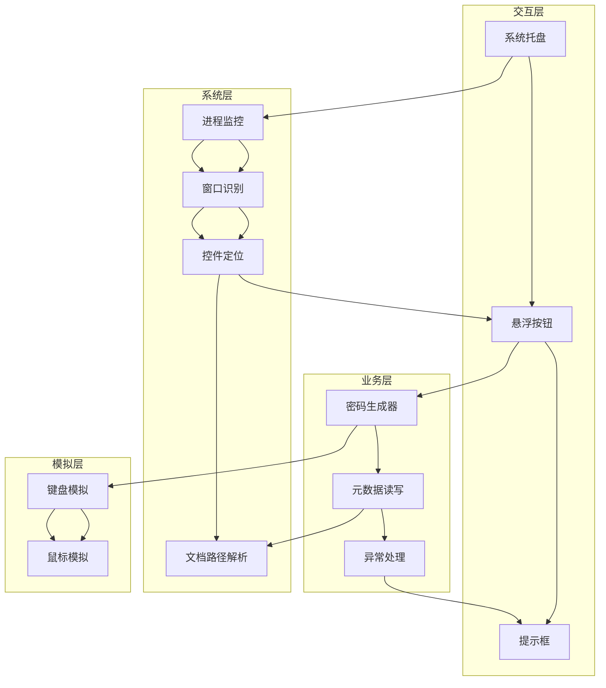
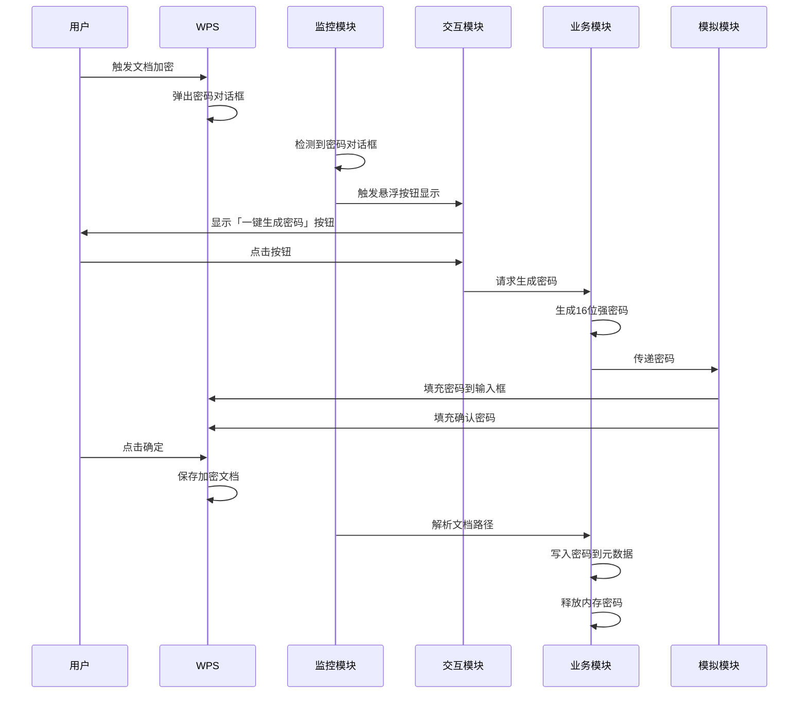
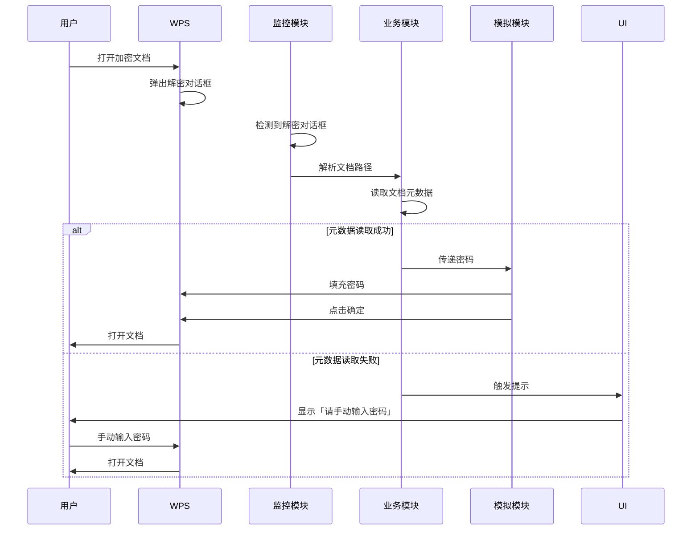

# WPS 密码自动填充插件 - 技术方案文档

## 1. 文档基础信息

| 项目项 | 具体内容 |
| :--- | :--- |
| 文档版本 | V1.0 |
| 产品名称 | WPS 密码自动填充客户端插件 |
| 开发目标 | 无 WPS 内部插件依赖，通过模拟人为操作实现 WPS docx 文档密码自动化管理，单安装包分发，零配置使用 |
| 适用系统 | 优先适配：Windows 10（64 位）1909 及以上专业版 / 企业版；向下兼容：Windows 7（64 位）SP1、Windows 11（64 位） |
| 适配 WPS 版本 | 优先适配：WPS Office Windows 12.1.0.25225（64 位）；向下兼容：WPS Office 2019/2021（64 位） |
| 技术核心 | 系统级 API 监控定位、模拟人为键鼠操作、WPS 文档元数据读写、Win10 系统专属适配、单安装包无依赖分发 |

## 2. 技术实现路径与关键技术选型

### 2.1 技术体系选择

| 技术栈 | 版本/规格 | 用途 | 选型理由 |
| :--- | :--- | :--- | :--- |
| C# | .NET 6 | 核心开发语言 | 成熟稳定，原生支持 Windows 系统 API，适合桌面应用开发 |
| .NET 6 | 独立发布 | 运行环境 | 打包运行时，无需用户安装 .NET 框架，实现无依赖部署 |
| Win32 API | 系统原生 | 进程/窗口监控、控件定位 | 直接调用系统底层 API，实现高效的窗口和控件识别 |
| Open XML | 标准库 | 文档元数据读写 | 符合 docx 格式标准，无需依赖 Office 组件 |
| WinForm | .NET 6 | 悬浮按钮、系统托盘、提示框 | 轻量级 UI 框架，适合后台程序的简单交互元素 |
| Inno Setup | 6.0+ | 安装包制作 | 成熟的安装包制作工具，支持静默安装和批量部署 |

### 2.2 关键技术点实现

#### 2.2.1 WPS 进程与窗口监控

使用 Win32 API 实现 WPS 进程和窗口的实时监控，核心代码示例：

```csharp
// 监控 WPS 进程是否运行
private bool IsWpsRunning()
{
    Process[] processes = Process.GetProcessesByName("wps");
    return processes.Length > 0;
}

// 查找 WPS 密码对话框
private IntPtr FindPasswordDialog()
{
    // 双基准环境特征匹配
    IntPtr dialogHandle = FindWindowByTitleAndClass("文档加密", "#32770");
    if (dialogHandle == IntPtr.Zero)
    {
        // 兼容环境模糊匹配
        dialogHandle = FindWindowByPartialTitle("密码");
    }
    return dialogHandle;
}
```

#### 2.2.2 控件定位与坐标校准

实现密码输入框的精准定位，支持 Win10 DPI 缩放和多显示器：

```csharp
// 定位密码输入框
private IntPtr FindPasswordEdit(IntPtr dialogHandle)
{
    // 双基准环境精准定位
    IntPtr editHandle = FindWindowEx(dialogHandle, IntPtr.Zero, "Edit", null);
    if (editHandle == IntPtr.Zero)
    {
        // 兼容环境遍历查找
        editHandle = FindEditControlByTraversal(dialogHandle);
    }
    return editHandle;
}

// DPI 缩放坐标校准
private Point CalibrateCoordinates(Point originalPoint)
{
    float dpiScale = GetDpiScale();
    return new Point(
        (int)(originalPoint.X * dpiScale),
        (int)(originalPoint.Y * dpiScale)
    );
}
```

#### 2.2.3 模拟键鼠操作

模拟人为操作实现密码填充和按钮点击：

```csharp
// 模拟密码输入
private void SimulatePasswordInput(IntPtr editHandle, string password)
{
    // 确保窗口在前台
    SetForegroundWindow(editHandle);
    Thread.Sleep(50);
    
    // 模拟输入密码
    foreach (char c in password)
    {
        keybd_event((byte)c, 0, 0, 0);
        keybd_event((byte)c, 0, 2, 0);
        Thread.Sleep(10);
    }
}

// 模拟鼠标点击
private void SimulateMouseClick(Point position)
{
    SetCursorPos(position.X, position.Y);
    mouse_event(MOUSEEVENTF_LEFTDOWN, 0, 0, 0, 0);
    Thread.Sleep(50);
    mouse_event(MOUSEEVENTF_LEFTUP, 0, 0, 0, 0);
}
```

#### 2.2.4 文档元数据读写

使用 Open XML 标准实现密码的写入和读取：

```csharp
// 写入密码到文档元数据
public bool WritePasswordToMetadata(string filePath, string password)
{
    try
    {
        using (WordprocessingDocument doc = WordprocessingDocument.Open(filePath, true))
        {
            // 获取自定义属性部分
            CustomFilePropertiesPart customProps = doc.CustomFilePropertiesPart;
            if (customProps == null)
            {
                customProps = doc.AddCustomFilePropertiesPart();
                customProps.Properties = new Properties();
            }
            
            // 创建或更新密码属性
            var passwordProp = customProps.Properties.Elements<CustomDocumentProperty>()
                .FirstOrDefault(p => p.Name.Value == "WpsPasswordManager");
            
            if (passwordProp == null)
            {
                passwordProp = new CustomDocumentProperty();
                passwordProp.Name = new Name() { Value = "WpsPasswordManager" };
                passwordProp.VTLPWSTR = new VTLPWSTR() { Text = password };
                customProps.Properties.Append(passwordProp);
            }
            else
            {
                passwordProp.VTLPWSTR.Text = password;
            }
            
            customProps.Properties.Save();
            return true;
        }
    }
    catch (Exception ex)
    {
        LogError("WritePasswordToMetadata", ex.Message);
        return false;
    }
}

// 从文档元数据读取密码
public string ReadPasswordFromMetadata(string filePath)
{
    try
    {
        using (WordprocessingDocument doc = WordprocessingDocument.Open(filePath, false))
        {
            CustomFilePropertiesPart customProps = doc.CustomFilePropertiesPart;
            if (customProps != null)
            {
                var passwordProp = customProps.Properties.Elements<CustomDocumentProperty>()
                    .FirstOrDefault(p => p.Name.Value == "WpsPasswordManager");
                
                if (passwordProp != null && passwordProp.VTLPWSTR != null)
                {
                    return passwordProp.VTLPWSTR.Text;
                }
            }
            return null;
        }
    }
    catch (Exception ex)
    {
        LogError("ReadPasswordFromMetadata", ex.Message);
        return null;
    }
}
```

## 3. 整体架构设计

### 3.1 架构分层

| 架构层级 | 核心职责 | 实现方式 | 模块名称 |
| :--- | :--- | :--- | :--- |
| 交互展示层 | 系统托盘管理、悬浮按钮展示与交互、提示框弹出 | WinForm 原生控件 | `UI` |
| 模拟操作层 | 密码输入模拟、鼠标点击模拟、键盘事件模拟 | 封装系统级键鼠模拟组件 | `Simulator` |
| 核心业务层 | 强密码生成、文档元数据读写、业务逻辑判断、异常处理 | C# 原生开发 + Open XML 标准 | `Business` |
| 系统监控层 | WPS 进程监控、对话框识别、控件定位、文档路径解析 | Win32 API + 系统级进程/窗口监控 | `Monitor` |
| 打包分发层 | 独立 EXE 编译、一键安装包制作、静默安装配置 | .NET 6 独立发布 + Inno Setup | `Deploy` |

### 3.2 模块间交互关系



**图 1: 模块间交互关系图**

## 4. 核心功能模块详细划分与职责定义

### 4.1 系统监控模块

| 子模块 | 职责 | 实现细节 |
| :--- | :--- | :--- |
| 进程监控 | 实时检测 WPS 进程状态 | 定时扫描系统进程，检测 wps.exe 是否运行 |
| 窗口识别 | 识别加密/解密对话框 | 基于窗口标题、类名进行特征匹配，支持双基准和兼容环境 |
| 控件定位 | 定位密码输入框和按钮 | 使用 Win32 API 查找控件句柄，支持精准定位和遍历查找 |
| 路径解析 | 解析文档本地路径 | 从对话框关联信息中提取文档路径，支持不同 WPS 版本 |
| 系统信息检测 | 检测系统版本和 DPI 缩放 | 自动检测 Windows 版本、DPI 缩放比例、显示器数量 |

### 4.2 核心业务模块

| 子模块 | 职责 | 实现细节 |
| :--- | :--- | :--- |
| 密码生成器 | 生成 16 位强密码 | 包含大写字母、小写字母、数字、特殊符号，各至少 2 位 |
| 元数据读写 | 读写文档自定义元数据 | 使用 Open XML 标准，仅对 docx 格式操作，支持重试机制 |
| 业务逻辑 | 处理加密/解密流程 | 协调各模块工作，实现完整的自动化流程 |
| 异常处理 | 处理各类异常情况 | 按异常类型执行不同处理逻辑，确保不干扰用户操作 |
| 日志管理 | 记录插件运行日志 | 异步写入本地日志，便于问题排查 |

### 4.3 模拟操作模块

| 子模块 | 职责 | 实现细节 |
| :--- | :--- | :--- |
| 键盘模拟 | 模拟密码输入 | 模拟人为打字，支持不同输入法环境 |
| 鼠标模拟 | 模拟按钮点击 | 精准定位并模拟鼠标点击，支持不同窗口状态 |
| 窗口管理 | 确保窗口在前台 | 激活 WPS 窗口，确保模拟操作生效 |

### 4.4 交互展示模块

| 子模块 | 职责 | 实现细节 |
| :--- | :--- | :--- |
| 系统托盘 | 提供插件状态和操作 | 显示托盘图标，支持右键菜单操作 |
| 悬浮按钮 | 提供一键生成密码功能 | 无边框、置顶、紧贴密码框右侧，支持 DPI 缩放 |
| 提示框 | 显示轻量提示信息 | 自动关闭，不阻塞用户操作 |

## 5. 数据流程设计

### 5.1 加密文档流程



**图 2: 加密文档数据流程图**

### 5.2 打开加密文档流程



**图 3: 打开加密文档数据流程图**

### 5.3 数据存储与传递机制

| 数据类型 | 存储方式 | 传递方式 | 安全措施 |
| :--- | :--- | :--- | :--- |
| 密码 | 文档自定义元数据 | 内存临时存储 | 写入元数据后立即释放内存 |
| 配置信息 | 本地配置文件 | 进程内传递 | 仅存储必要配置，无敏感信息 |
| 日志信息 | 本地日志文件 | 异步写入 | 不记录密码等敏感信息 |
| 系统信息 | 内存缓存 | 进程内传递 | 仅用于适配，不持久化 |

## 6. 多层次安全策略

### 6.1 密码加密存储

| 安全措施 | 实现方式 | 效果 |
| :--- | :--- | :--- |
| 元数据存储 | 写入文档自定义属性 | 密码随文档存储，无外部依赖 |
| 内存管理 | 写入后立即释放 | 密码仅在内存中短暂存在 |
| 格式限制 | 仅支持 docx 格式 | 避免非标准格式的安全风险 |

### 6.2 数据传输安全

| 安全措施 | 实现方式 | 效果 |
| :--- | :--- | :--- |
| 离线运行 | 无网络依赖 | 避免网络传输风险 |
| 进程内传递 | 内存直接传递 | 减少数据暴露面 |
| 操作模拟 | 本地系统 API | 避免第三方库引入的安全风险 |

### 6.3 用户隐私保护

| 安全措施 | 实现方式 | 效果 |
| :--- | :--- | :--- |
| 无数据上传 | 全程离线运行 | 用户数据不离开本地 |
| 无独立存储 | 密码仅在文档中 | 避免集中存储风险 |
| 最小权限 | 仅需普通管理员权限 | 减少系统权限风险 |
| 透明操作 | 模拟人为操作 | 用户可直观看到操作过程 |

## 7. 兼容性处理策略

### 7.1 跨 WPS 版本兼容

| 版本 | 兼容策略 | 实现方式 |
| :--- | :--- | :--- |
| WPS 12.1.0.25225 | 精准特征匹配 | 使用固定的窗口标题、类名、控件 ID |
| WPS 2019/2021 | 模糊特征匹配 | 使用关键词匹配、控件遍历查找 |
| 其他版本 | 降级处理 | 仅保证核心功能，可能无悬浮按钮 |

### 7.2 跨操作系统兼容

| 系统 | 兼容策略 | 实现方式 |
| :--- | :--- | :--- |
| Windows 10 | 完整适配 | 支持 DPI 缩放、多显示器、沉浸式窗口 |
| Windows 7 | 核心功能 | 仅支持 100% DPI 缩放，基本功能可用 |
| Windows 11 | 完整适配 | 兼容 Windows 11 窗口特性，功能完整 |

### 7.3 异常处理与降级机制

| 异常类型 | 处理策略 | 降级机制 |
| :--- | :--- | :--- |
| 控件识别失败 | 记录日志，不干扰用户 | 完全放行用户手动操作 |
| 元数据读写失败 | 轻量提示，重试机制 | 提示用户手动输入密码 |
| 模拟操作失败 | 二次重试，备用逻辑 | 双基准环境强制重试，兼容环境放行 |
| DPI 缩放异常 | 自动校准，记录日志 | 按 100% 比例校准，确保基本功能 |

## 8. 开发计划与里程碑

### 8.1 开发阶段划分

| 阶段 | 时间 | 主要任务 | 里程碑 |
| :--- | :--- | :--- | :--- |
| 准备阶段 | 1 周 | 环境搭建、需求分析、技术选型 | 完成技术方案文档 |
| 核心开发阶段 | 3 周 | 系统监控模块、核心业务模块、模拟操作模块 | 完成核心功能开发 |
| UI 开发阶段 | 1 周 | 交互展示模块、系统托盘、悬浮按钮、提示框 | 完成 UI 功能开发 |
| 测试阶段 | 2 周 | 功能测试、兼容性测试、性能测试 | 完成测试报告 |
| 打包部署阶段 | 1 周 | 独立 EXE 编译、安装包制作、静默安装配置 | 完成发布版本 |

### 8.2 关键里程碑

| 里程碑 | 完成标准 | 交付物 |
| :--- | :--- | :--- |
| 技术方案确认 | 技术方案文档通过评审 | 技术方案文档 |
| 核心功能实现 | 加密/解密流程自动化测试通过 | 核心功能代码 |
| UI 功能实现 | 悬浮按钮、系统托盘、提示框功能正常 | UI 功能代码 |
| 兼容性验证 | 在所有目标环境下功能可用 | 兼容性测试报告 |
| 性能优化 | 资源占用符合要求，响应速度达标 | 性能测试报告 |
| 发布版本 | 单文件安装包制作完成，支持静默安装 | 安装包文件 |

## 9. 风险评估与应对策略

| 风险 | 影响 | 应对策略 |
| :--- | :--- | :--- |
| WPS 版本更新导致控件特征变化 | 控件识别失败，功能不可用 | 建立版本检测机制，适配不同版本特征 |
| Windows 系统更新影响 API 调用 | 系统 API 失效，功能异常 | 使用稳定的 Win32 API，避免使用非公开接口 |
| 文档被其他程序占用 | 元数据读写失败 | 实现重试机制，最多重试 3 次 |
| 权限不足导致操作失败 | 模拟操作被系统拦截 | 适配不同系统权限，使用合适的模拟方式 |
| 性能占用过高 | 影响 WPS 运行 | 优化代码，使用异步处理，减少资源占用 |

## 10. 技术可行性分析

### 10.1 技术实现可行性

- **系统 API 调用**：Win32 API 是 Windows 系统原生接口，稳定性高，可实现所需的进程监控、窗口识别和控件定位功能。
- **模拟操作**：通过系统级 API 模拟键鼠操作，可实现与人为操作一致的效果，WPS 无感知。
- **元数据读写**：Open XML 是 docx 格式的标准，可通过 .NET 标准库实现，无需依赖 Office 组件。
- **无依赖部署**：.NET 6 独立发布模式可将运行时打包进 EXE，实现单文件分发。

### 10.2 性能可行性

- **资源占用**：插件采用后台运行模式，仅在检测到 WPS 对话框时进行处理，平时资源占用极低。
- **响应速度**：通过特征匹配和精准定位，对话框识别响应时间可控制在 100ms 以内。
- **稳定性**：采用分层架构和异常处理机制，确保插件持续稳定运行。

### 10.3 兼容性可行性

- **跨 WPS 版本**：通过特征匹配和降级机制，可支持不同 WPS 版本的核心功能。
- **跨操作系统**：针对不同 Windows 版本的特性进行适配，确保核心功能可用。
- **DPI 缩放**：实现 DPI 缩放适配，支持不同显示设置。

## 11. 结论

本技术方案基于 C# + .NET 6 + Win32 API 技术栈，通过系统级监控和模拟操作，实现了 WPS 密码自动填充插件的核心功能。方案充分考虑了兼容性、安全性和性能要求，可满足企业日常办公的密码自动化管理需求。

通过分阶段的开发计划和明确的里程碑，可确保项目有序推进，最终交付符合要求的产品。同时，方案预留了扩展空间，可在未来根据用户需求进行功能增强和性能优化。