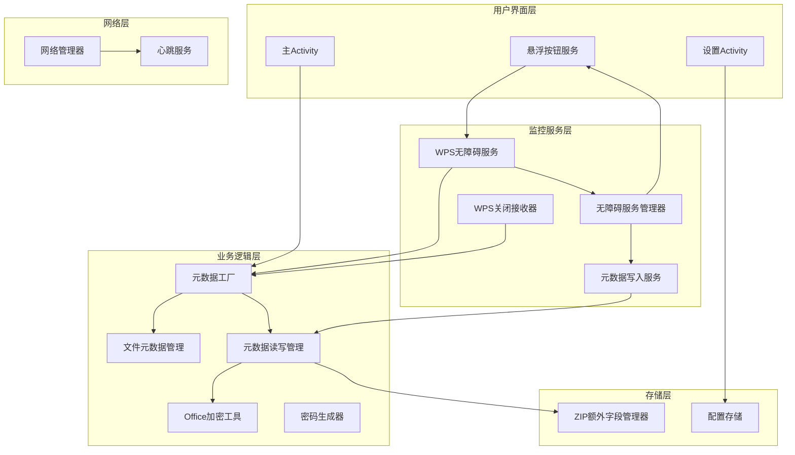
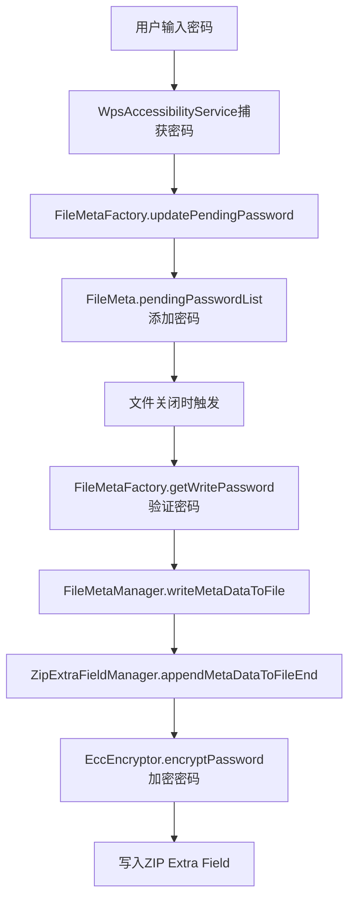
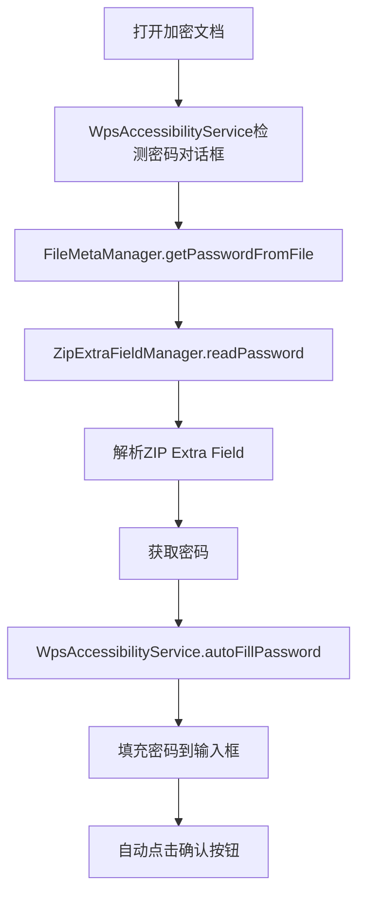

# 通用业务技术文档

## 1. 项目概述

WPS密码管理器是一款专为WPS Office文档设计的密码管理应用，主要功能包括密码自动填充、密码加密存储、文档权限管理等。本项目旨在提升用户在使用WPS Office时的密码管理体验，确保文档安全的同时提供便捷的密码操作。

### 1.1 主要功能
- **密码自动填充**：在打开加密文档时自动填充密码
- **密码加密存储**：使用ZIP Extra Field和ECC加密技术安全存储密码
- **文档权限管理**：记录文档的读写权限信息
- **密码生成**：提供密码生成功能
- **无障碍服务**：通过无障碍服务监控WPS应用的密码输入和确认操作

## 2. 架构设计

### 2.1 整体架构



### 2.2 模块职责

| 模块 | 主要职责 | 文件位置 |
|------|---------|----------|
| 文件元数据管理 | 管理文件的密码和权限信息 | app/src/main/java/com/wpspasswordmanager/business/FileMeta.kt |
| 元数据工厂 | 创建和管理文件元数据实例 | app/src/main/java/com/wpspasswordmanager/business/FileMetaFactory.kt |
| 元数据读写管理 | 从文件中读取和写入元数据 | app/src/main/java/com/wpspasswordmanager/business/FileMetaManager.kt |
| ZIP额外字段管理 | 管理ZIP文件的额外字段存储 | app/src/main/java/com/wpspasswordmanager/business/ZipExtraFieldManager.kt |
| WPS无障碍服务 | 监控WPS应用的密码输入和操作 | app/src/main/java/com/wpspasswordmanager/monitor/WpsAccessibilityService.kt |
| 无障碍服务管理器 | 管理无障碍服务和悬浮按钮 | app/src/main/java/com/wpspasswordmanager/monitor/AccessibilityServiceManager.kt |
| 配置存储 | 存储服务器配置和用户信息 | app/src/main/java/com/wpspasswordmanager/storage/ConfigStorage.kt |
| Office加密工具 | 验证Office文件密码和检查加密状态 | app/src/main/java/com/wpspasswordmanager/business/OfficeEncryptUtils.kt |

## 3. 核心功能模块

### 3.1 文件元数据管理 (FileMeta)

FileMeta类是整个系统的核心数据结构，用于存储文件的密码和权限信息：

```kotlin
data class FileMeta(
    val filePath: String,            // 文件绝对路径 (作为唯一标识)
    var uid: String?,                // 文件权限标识
    var currentPassword: String?,    // 旧密码：当前已确认生效的密码
    var pendingPasswordList: OrderedSet<String>? = null, // 待定密码：无障碍服务捕获到的新密码集合
    var ownerAccount: String? = null, // 文档所属账号
    var ownerName: String? = null,    // 文档所属名称
    var readAuth: Boolean = false,    // 读权限
    var writeAuth: Boolean = false,   // 写权限
)
```

### 3.2 元数据工厂 (FileMetaFactory)

FileMetaFactory负责创建和管理FileMeta实例，提供以下核心功能：

- **初始化文件元数据**：在文件打开时创建FileMeta实例
- **更新待定密码**：无障碍服务捕获到密码时更新到FileMeta
- **获取写入密码**：验证待定密码并返回有效的密码
- **清理文件资源**：在文件关闭时清理FileMeta实例

### 3.3 元数据读写管理 (FileMetaManager)

FileMetaManager负责从文件中读取和写入元数据：

- **读取密码**：从ZIP Extra Field中读取密码
- **读取UID**：从ZIP Extra Field中读取文件标识
- **写入元数据**：将密码和UID写入ZIP Extra Field

### 3.4 ZIP额外字段管理 (ZipExtraFieldManager)

ZipExtraFieldManager是实现密码存储的核心组件，通过在ZIP文件末尾添加额外字段来存储密码和UID：

- **构建额外字段数据**：按照特定格式构建包含密码和UID的数据
- **读取额外字段数据**：从文件末尾读取并解析额外字段
- **删除旧标记**：在写入新数据前删除旧的WPPM标记
- **ECC加密**：使用ECC算法加密密码

### 3.5 WPS无障碍服务 (WpsAccessibilityService)

WpsAccessibilityService是监控WPS应用密码操作的核心服务：

- **检测密码对话框**：识别WPS的密码输入对话框
- **自动填充密码**：在打开加密文档时自动填充密码
- **捕获密码输入**：监控用户输入的密码
- **处理确认操作**：在用户确认密码时更新密码状态

## 4. 数据流转逻辑

### 4.1 密码存储流程



### 4.2 密码读取流程



### 4.3 数据存储方案

| 存储类型 | 存储位置 | 存储内容 | 用途 |
|---------|---------|---------|------|
| 内存存储 | ConcurrentHashMap | FileMeta实例 | 运行时管理文件元数据 |
| 持久化存储 | SharedPreferences | 服务器配置、用户信息、密码 | 保存配置和用户数据 |
| 文件存储 | ZIP Extra Field | 加密后的密码、UID | 持久化存储文件密码 |

## 5. 关键技术栈

| 技术 | 版本 | 用途 | 来源 |
|------|------|------|------|
| Kotlin | 1.7+ | 主要开发语言 | build.gradle |
| AndroidX | 最新版 | Android支持库 | build.gradle |
| Apache POI | 5.2.3 | Office文件处理 | build.gradle |
| BouncyCastle | 1.70 | 加密库 | build.gradle |
| Gson | 2.10.1 | JSON处理 | build.gradle |
| OkHttp | 4.10.0 | 网络请求 | build.gradle |
| 无障碍服务 | Android系统API | 监控WPS应用操作 | Android框架 |

## 6. 实现细节

### 6.1 密码加密实现

项目使用ECC（椭圆曲线密码学）算法加密密码，具体实现如下：

1. **密钥协商**：使用ECDH算法与服务器公钥协商共享密钥
2. **密钥派生**：使用SHA-256从共享密钥派生AES密钥
3. **AES加密**：使用AES-CBC模式加密密码
4. **数据组合**：将临时公钥、IV和密文组合后Base64编码

### 6.2 ZIP Extra Field存储格式

ZIP Extra Field的存储格式如下：

```
Magic(4字节) + Version(2字节) + Type(1字节) + DataLength(4字节) + Data(N字节) + Checksum(4字节)
```

- **Magic**："WPPM"（WPS Password Manager的缩写）
- **Version**：版本号，当前为1
- **Type**：数据类型，1表示密码，2表示UID
- **DataLength**：数据长度
- **Data**：实际数据（密码或UID）
- **Checksum**：CRC32校验和

### 6.3 无障碍服务监控

WpsAccessibilityService通过以下方式监控WPS应用：

1. **事件监听**：监听窗口状态变化、内容变化、视图点击等事件
2. **对话框检测**：识别密码输入对话框类型（打开加密文档、添加密码、修改密码）
3. **密码捕获**：监控密码输入框的文本变化
4. **自动操作**：自动点击显示密码选项、自动填充密码、自动点击确认按钮

### 6.4 密码验证机制

项目使用Apache POI库验证Office文件密码：

1. **检查文件加密状态**：通过尝试获取EncryptionInfo判断文件是否加密
2. **验证密码**：使用POI的decryptor.verifyPassword方法验证密码
3. **密码选择**：从待定密码列表中选择有效的密码

## 7. 业务流程

### 7.1 打开加密文档流程

1. 用户打开WPS加密文档
2. WPS显示密码输入对话框
3. WpsAccessibilityService检测到密码对话框
4. FileMetaManager从文件中读取密码
5. WpsAccessibilityService自动填充密码
6. WpsAccessibilityService自动点击确认按钮
7. 文档打开成功

### 7.2 修改密码流程

1. 用户在WPS中修改文档密码
2. WPS显示修改密码对话框
3. WpsAccessibilityService检测到修改密码对话框
4. WpsAccessibilityService自动勾选显示密码选项
5. 用户输入新密码
6. WpsAccessibilityService捕获新密码
7. 用户点击确认按钮
8. FileMetaFactory更新待定密码
9. 文件关闭时，FileMetaManager验证并写入新密码

### 7.3 添加密码流程

1. 用户在WPS中为文档添加密码
2. WPS显示添加密码对话框
3. WpsAccessibilityService检测到添加密码对话框
4. WpsAccessibilityService自动勾选显示密码选项
5. 用户输入密码
6. WpsAccessibilityService捕获密码
7. 用户点击确认按钮
8. FileMetaFactory更新待定密码
9. 文件关闭时，FileMetaManager验证并写入密码

## 8. 技术参考依据

### 8.1 密码存储安全性

- **加密存储**：使用ECC+AES加密密码
- **本地存储**：密码存储在文件本身，不依赖外部服务器
- **校验机制**：使用CRC32校验确保数据完整性

### 8.2 无障碍服务实现

- **事件处理**：全面处理WPS应用的各种事件
- **状态管理**：维护密码输入和确认的状态
- **自动操作**：提供便捷的自动填充和点击功能

### 8.3 跨平台适配考虑

- **文件格式兼容**：使用标准ZIP Extra Field格式，确保跨平台兼容
- **加密算法标准**：使用标准ECC和AES算法
- **权限管理**：统一的权限管理机制

### 8.4 Windows版本插件开发参考

1. **核心功能移植**：
   - 文件元数据管理
   - ZIP Extra Field读写
   - 密码加密存储
   - 密码自动填充

2. **技术栈选择**：
   - C#或C++开发Windows插件
   - 使用.NET Framework或原生Windows API
   - 集成Office插件开发框架

3. **实现重点**：
   - 文件系统监控
   - Office应用集成
   - 密码安全存储
   - 用户界面交互

## 9. 总结

WPS密码管理器项目采用了先进的技术方案，实现了安全、便捷的密码管理功能。通过ZIP Extra Field存储、ECC加密、无障碍服务监控等技术，为用户提供了良好的密码管理体验。

本技术文档详细介绍了项目的架构设计、核心功能、数据流转和技术实现，为后续开发Windows版本插件应用提供了全面的技术参考依据。通过参考本文档，开发团队可以快速理解项目的技术方案，并在Windows平台上实现类似的功能。